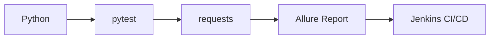

<div align="center">

# TestForge

**接口自动化测试框架 | API Automation Testing Framework**

[](https://www.python.org/)
[](https://pytest.org/)
[](https://qameta.io/allure-report/)
[](https://www.jenkins.io/)
[](LICENSE)

基于 pytest + requests + Allure 的接口自动化测试框架，用于学习与实习准备。

</div>

---

## 📋 目录

- [功能特性](#-功能特性)
- [技术栈](#-技术栈)
- [快速开始](#-快速开始)
- [项目结构](#-项目结构)
- [编写测试](#-编写测试)
- [实习简历](#-实习简历)
- [English Version](#english-version)

---

## ✨ 功能特性

| 功能 | 状态 | 位置 |
|---------:|:--------|:------|
| ✅ **GET 请求封装** | 已完成 | [test_user_api.py](tests/test_user_api.py) |
| ✅ **POST 请求封装** | 已完成 | [test_post_api.py](tests/test_post_api.py) |
| ✅ **通用请求工具类** | 已完成 | [common/request_util.py](common/request_util.py) |
| ✅ **日志模块** | 已完成 | [common/log_util.py](common/log_util.py) |
| ✅ **Allure 测试报告** | 已完成 | [pytest.ini](pytest.ini) |
| ✅ **Jenkins 流水线** | 已完成 | [Jenkinsfile](Jenkinsfile) |

---

## 🛠️ 技术栈



| 技术 | 用途 |
|-------:|:------|
| **Python 3.11** | 编程语言 |
| **pytest** | 测试框架 |
| **requests** | HTTP 客户端 |
| **Allure** | 可视化测试报告 |
| **Jenkins** | CI/CD 持续集成流水线 |

---

## 🚀 快速开始

### 1️⃣ 安装依赖

```bash
pip install -r requirements.txt
```

### 2️⃣ 运行全部测试

> **Windows PowerShell 用户注意：请先进入正确目录**

```powershell
cd D:\codecode\testforge\testforge
$env:PYTHONPATH = "D:\codecode\testforge\testforge"
python -m pytest -v
```

**运行结果示例：**
```
collected 3 items

tests/test_demo.py::test_get_request PASSED
tests/test_post_api.py::test_create_post PASSED
tests/test_user_api.py::test_get_user PASSED
```

### 3️⃣ 生成 Allure 报告

```bash
allure serve ./allure-results
```

---

## 📁 项目结构

```
testforge/
├── 📂 common/                  # 工具类目录
│   ├── request_util.py         # GET/POST 请求封装
│   └── log_util.py             # 控制台+文件双输出日志
├── 📂 tests/                    # 测试用例目录
│   ├── test_demo.py            # 基础连通性测试
│   ├── test_user_api.py        # GET /users/1 业务断言
│   └── test_post_api.py        # POST /posts JSON 请求
├── 📄 Jenkinsfile               # CI/CD 流水线配置
├── 📄 pytest.ini                # pytest + Allure 配置
├── 📄 requirements.txt          # 依赖清单
├── 📄 jenkins-guide.md          # Jenkins 分步配置手册
└── 📄 README.md                 # 本文档
```

---

## 📝 编写测试

```python
import pytest
from common.request_util import RequestUtil

@pytest.fixture
def api():
    return RequestUtil()

def test_your_case(api):
    response = api.get("https://你的接口地址/endpoint")
    assert response.status_code == 200        # HTTP 层断言
    
    data = response.json()
    assert data["key"] == "预期值"             # 业务层断言
```

---

## 🎓 实习简历

这个项目展示了以下技能：

| 技能 | 如何体现 |
|-------:|:------|
| Python 面向对象 | `RequestUtil` 类封装设计 |
| pytest 框架 | fixture 依赖注入、断言设计、配置管理 |
| 接口测试 | GET/POST 方法封装、HTTP + 业务双层断言 |
| CI/CD 持续集成 | Declarative 风格 Jenkinsfile 流水线 |
| 日志模块 | 控制台+文件双输出日志模块设计 |
| 版本控制 | GitHub 代码仓库管理 |

---

---

<div id="english-version"></div>

---

<div align="center">

# English Version

A pytest-based API automation testing framework for learning and internship preparation.

[](https://www.python.org/)
[](https://pytest.org/)
[](https://qameta.io/allure-report/)
[](https://www.jenkins.io/)
[](LICENSE)

</div>

---

## 📋 Table of Contents

- [Features](#-features)
- [Tech Stack](#-tech-stack)
- [Quick Start](#-quick-start)
- [Project Structure](#-project-structure)
- [Writing Tests](#-writing-tests)
- [For Internship](#-for-internship-preparation)

---

## ✨ Features

| Feature | Status | Location |
|---------:|:--------|:------|
| ✅ **GET Request** | Done | [test_user_api.py](tests/test_user_api.py) |
| ✅ **POST Request** | Done | [test_post_api.py](tests/test_post_api.py) |
| ✅ **Request Utility** | Done | [common/request_util.py](common/request_util.py) |
| ✅ **Logging** | Done | [common/log_util.py](common/log_util.py) |
| ✅ **Allure Report** | Done | [pytest.ini](pytest.ini) |
| ✅ **Jenkins Pipeline** | Done | [Jenkinsfile](Jenkinsfile) |

---

## 🛠️ Tech Stack

| Technology | Purpose |
|-----------:|:------|
| **Python 3.11** | Programming Language |
| **pytest** | Testing framework |
| **requests** | HTTP client |
| **Allure** | Beautiful test reports |
| **Jenkins** | CI/CD pipeline |

---

## 🚀 Quick Start

### 1️⃣ Install Dependencies

```bash
pip install -r requirements.txt
```

### 2️⃣ Run All Tests

> **Windows PowerShell: Enter correct directory first**

```powershell
cd D:\codecode\testforge\testforge
$env:PYTHONPATH = "D:\codecode\testforge\testforge"
python -m pytest -v
```

**Output Example:**
```
collected 3 items

tests/test_demo.py::test_get_request PASSED
tests/test_post_api.py::test_create_post PASSED
tests/test_user_api.py::test_get_user PASSED
```

### 3️⃣ Generate Allure Report

```bash
allure serve ./allure-results
```

---

## 📁 Project Structure

```
testforge/
├── 📂 common/                  # Utilities
│   ├── request_util.py         # GET/POST wrapper
│   └── log_util.py             # Console + File logging
├── 📂 tests/                    # Test cases
│   ├── test_demo.py            # Basic connectivity test
│   ├── test_user_api.py        # GET /users/1 assertions
│   └── test_post_api.py        # POST /posts JSON body
├── 📄 Jenkinsfile               # CI/CD pipeline
├── 📄 pytest.ini                # pytest + Allure config
├── 📄 requirements.txt          # Dependencies
├── 📄 jenkins-guide.md          # Step-by-step Jenkins guide
└── 📄 README.md                 # This document
```

---

## 📝 Writing Tests

```python
import pytest
from common.request_util import RequestUtil

@pytest.fixture
def api():
    return RequestUtil()

def test_your_case(api):
    response = api.get("https://your-api.com/endpoint")
    assert response.status_code == 200        # HTTP layer
    
    data = response.json()
    assert data["key"] == "expected value"     # Business layer
```

---

## 🎓 For Internship Preparation

| Skill | Demonstration |
|-------:|:------|
| Python OOP | `RequestUtil` class encapsulation |
| pytest | fixtures, assertions, configuration |
| API Testing | GET/POST methods, HTTP + Business assertions |
| CI/CD | Declarative Jenkinsfile |
| Logging | Dual-output logging module design |
| Git | GitHub repository management |

---

<div align="center">

**Made with ❤️ for learning and internship preparation**

[⬆️ Back to Chinese Version](#-目录) • [GitHub Repository](https://github.com/aireate/testforge)

</div>
